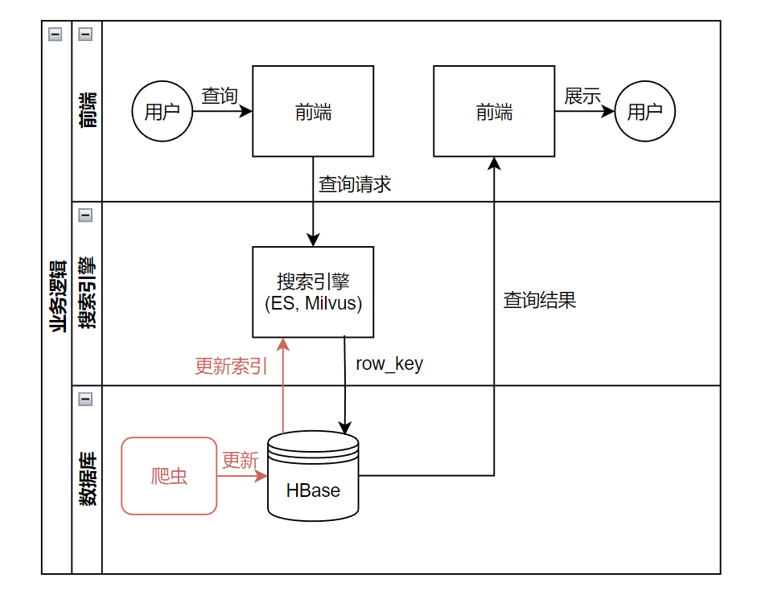

# 大数据系统实验

## 组员名单及具体分工

- PB21030838 罗浩铭:负责整体框架的搭建，以及检索部分（包括传统查询数据库elastic search, 向量查询数据库milvus的搭建与交互），并完成了项目在云服务器上的部署，以及上台答辩
- PB21061199 范晨晓:负责爬虫部分（包括设置对不同网页的遍历方式控制），以及对网页数据的解析与存储，参与了与hbase数据库交互的工作
- PB21151807 刘海琳:负责hbase数据库的搭建与交互部分，前端搭建，以及答辩PPT制作


## 技术路线
### 概述
我们基于HBase, ElasticSearch, Milvus等框架及其Python API实现了一个文件查询系统，用于查找中科大各校内网站的在线文件。我们使用爬虫来从各个网站爬取各文件的标题、URL、日期、来源等信息，并将这些信息存储到HBase数据库中，同时在ElasticSearch搜索引擎与Milvus向量查询数据库建立查询索引，以便用户以关键词检索文件标题。我们使用ElasticSearch来对文件的标题、来源等信息进行检索，同时使用Milvus来对文件标题的embedding进行向量查询以扩展搜索结果。搜索结果以rowkey与Hbase数据库关联，按这些rowkey从HBase数据库中读出文件信息。最终我们使用gradio框架搭建了一个简单的前端，用于接收用户的查询请求，并美观地展示查询结果。

系统工作流程如下面泳道图所示：


网站已经在云服务器上部署，可以通过[USTC File Finder](http://47.76.73.185:7860/)来访问。
也可扫描以下二维码访问：


### 代码框架
源代码框架如下：

```txt
USTC_File_Finder
├── docs # 文档
├── env # elastic search与milvus的docker-compose文件
├── src # 源代码
│   ├── crawler # 爬虫
│   ├── data_access # 数据库访问接口
│   ├── server # 后端
|   ├── config.py # 配置信息，整个项目的配置信息都在这里
|   ├── main.py # 项目入口
|   └── test.py # 测试代码，定义了一个Tester.py类，用于测试各个模块的功能
```

其中`crawler`包含了爬虫部分的代码，`data_access`包含了HBase数据库访问及ElasticSearch与Milvus查询的代码，`server`包含了前端及其所需后端逻辑的代码，`config.py`包含了整个项目的配置信息，`main.py`是项目的入口，`test.py`包含了测试代码，定义了一个`Tester.py`类，用于测试各个模块的功能。

### 项目依赖项
项目依赖项及其版本如下：
- JDK:8u171
- Hadoop:2.10.2
- HBase:2.5.5
- ElasticSearch:7.17.1
- Milvus:v2.3.1

### 爬虫
crawler文件夹下的文件结构为:
- crawler.py：爬虫类，实现对网站结构数据web_list.json的读取，自动遍历所有网站的所有可见页码，将结果输出在csv文件中
- web_list.json：存储着所有网站的url、编码方式、翻页策略、名称以及结构信息，以便爬虫函数调用
- file_list.csv：爬虫函数完成读取后，输出的文件列表。包含文件url、名称、发布时间以及来源
- web_list.txt：前期调研时收集的网站数据，用于逐个分析网站html结构，人力构建web_list.json。共收集了91个网站的数据

#### web_list.json结构：
&emsp;&emsp;这个数据库中存储着所有网站的结构信息，这样，只需要通过一个统一的爬虫函数，就可以实现对不同的网站进行爬取。
&emsp;&emsp;以下是一项网站数据的内容示例。在这个数据库中，一共存储着91个这样的数据，以便于实现对网站文件内容的实时读取与刷新。
```
{
    "url": "https://finance.ustc.edu.cn/xzzx/list{page_num}.psp",
    # 网站网址
    "encoding": null,
    # 有的网站需要指定'utf-8'编码方式
    "title": "财务处",
    # 该网站名称
    "dtype": null,
    # 有的网站有多个子文件列表，在此处存储一级文件列表名称
    "dtype2": null,
    # 有的网站有多个子文件列表，在此处存储二级文件列表名称
    "flip": true,
    # 标识该网站是否可翻页，可翻页的网站均在url中标识了翻页逻辑
    "html_locator": [
        # 用于定位文件列表，包含着若干个字典，每个字典对应一次定位操作
        {
            "method": "find",   # 定位所用方法
            "args": "ul",       # 定位对象
            "kwargs": {         # 可选的辅助定位参数
                "class_": "news_list list2"
            }
        },
        {
            "method": "find_all",
            "args": "li"
        }
    ],
    "info_locator": [
        # 得到文件列表后，对文件中的每一项对应的名称、url、时间进行定位。每个字典对应对一个对象进行定位
        {
            "info": "title",    # 定位对象
            "method": "find",   # 定位方法
            "args": "a",        # 定位对象的类型。可为字符串（不需要额外辅助定位参数），也可为字典（需要额外辅助定位参数）
            "args2": "text"     # 提取出对象的形式
        },
        {
            "info": "url",
            "method": "find",
            "args": "a",
            "args2": "href"
        },
        {
            "info": "time",
            "method": "find",
            "args": [
                "span",
                {
                    "class_": "news_meta"
                }
            ],
            "args2": "text"
        }
    ]
}
```
其主要分为三部分：
- 网站基本信息：主要包括网站url范式、编码方式、是否可翻页，主要用于提供网页元信息及控制翻页逻辑
- html_locator：用于定位文件列表，包含着若干个字典，每个字典对应一次定位操作
- info_locator：得到文件列表后，对文件中的每一项对应的名称、url、时间进行定位。每个字典对应对一个对象进行定位

#### crawler.py函数：
&emsp;&emsp;在爬虫函数中，定义了一个爬虫类。类中有以下功能函数：
- <kbd>fetch_data</kbd>：通过指定的url和编码方式，读取网站html结构的文本信息
- <kbd>fetch_file</kbd>：从web_list.json获取出网站的结构信息，利用结构信息定位到文件所在的列表
- <kbd>get_info</kbd>：实现根据web_list.json中存储的内容对应结构信息，返回对应内容的文本
- <kbd>fetch_file_list</kbd>：调用fetch_file得到文件列表后，对列表中的项逐个遍历，利用web_list.json文件中所存储的各项内容的结构信息，读取出每个文件的url、时间、标题等内容，并对数据格式进行一定处理
- <kbd>generate_file_list</kbd>：对web_list.json中的每一项（每一项对应一个网站）进行读取，并对可以翻页的网站进行翻页遍历直至无法获取内容为止。调用fetch_file_list得到文件列表并返回
- <kbd>generate_file_csv</kbd>：将generate_file_list返回的文件列表写入csv文件中，以便下游数据库的接入

#### file_list.csv：
&emsp;&emsp;存储着爬取得到的文件信息。以下为内容示例：
|    列名     |                                               信息                                               |
| :---------: | :----------------------------------------------------------------------------------------------: |
|    title    |                                   研究生教学研究项目立项申请书                                   |
|     url     | http://gradschool.ustc.edu.cn/static/upload/article/picture/786794f67b044809935173f9cbc44110.doc |
|    time     |                                            2020-03-10                                            |
|   source    |                                             研究生院                                             |
|  file_type  |                                             培养工作                                             |
| file_type_2 |                                             教学研究                                             |


各个网站爬取的文件数量如下：
|          网站          | 文件数 |
| :--------------------: | :----: |
|         教务处         |  854   |
|        研究生院        |  253   |
|        软件学院        |  177   |
|     先进技术研究院     |  139   |
|      网络信息中心      |   91   |
|    国际合作与交流部    |   75   |
|        超算中心        |   71   |
|         财务处         |   58   |
|        学工在线        |   58   |
|    信息科学技术学院    |   43   |
|         出版社         |   39   |
|     苏州高等研究院     |   35   |
|    资产与后勤保障处    |   30   |
|   计算机科学技术学院   |   23   |
|        青春科大        |   23   |
|    保卫与校园管理处    |   17   |
|    信息科学实验中心    |   16   |
| 科技成果转移转化办公室 |   15   |
|    网络空间安全学院    |   14   |
|       大数据学院       |   7    |
|      工程科学学院      |   7    |

文件数共为2045个。

#### 我们在爬虫部分的技术路线亮点有：
- 通过json数据库存储所有网站的结构信息，数据可维护性好
- 使用统一的爬虫函数，代码整洁
- 可以实现自动遍历数据库中的所有网站，对文件信息进行更新
- 实现了自动翻页，一方面提升了文件内容、另一方面也使得网站结构数据库精简可阅读性好
- 解决了一些网站显示的bug，例如软件学院的网站文件时间有误（可能是发生过数据迁移导致的）。我们重新读取修正了时间数据


### hbase数据库
我们基于Python的happybase库，并借助HBase的Thrift服务，来实现我们的项目与HBase数据库之间的交互。

我们实现了一个`HbaseHelper`类，用来管理与HBase数据库之间的连接与增删改查操作。我们还实现了以我们项目定义的`FileRecord`文件信息类为API的数据库交互函数，包括将`FileRecord`对象存入HBase数据库或覆盖HBase数据库中原有条目的`put_file`函数，以及将HBase数据库中读出数据转换为`FileRecord`对象的`get_file`函数。

其中，`FileRecord`类的定义如下：
```python
class FileRecord:
    def __init__(self, title, url, time, source, file_type, file_type_2) -> None:
        self.title = str(title)
        self.url = str(url)
        self.time = str(time)
        self.source = str(source)
        self.file_type = str(file_type)
        self.file_type_2 = str(file_type_2)

    def __str__(self) -> str:
        return f'{self.title},{self.url},{self.time},{self.source},{self.file_type},{self.file_type2}'

    def get_hbase_data_format(self):
        return {
            b'info:title': self.title.encode(), # "string".encode() -> b"string" (bytes), 
            b'info:url': self.url.encode(),
            b'info:time': self.time.encode(),
            b'info:source': self.source.encode(),
            b'info:file_type': self.file_type.encode(),
            b'info:file_type_2': self.file_type_2.encode()
        }
```
我们将文件信息各字段存入的FileRecord类中，并实现了将其转为HBase数据接口的函数`get_hbase_data_format`，将类信息转为happybase库要求的字节流key-value对形式，以便于将其存入HBase数据库。

`HbaseHelper`中，我们在这里仅讲解最复杂的`put_file`函数（因其需要管理自增计数器），其实现如下：
```python
class HbaseHelper:
    # ...
    def put_file(self, file_record: FileRecord):
        increment_id = self.table.counter_inc(b'row_increment_id', b'counter:increment_id')
        row_key_str = f'row_{increment_id}'
        row_key = row_key_str.encode()
        self.put(row_key, file_record.get_hbase_data_format())
        return increment_id, row_key_str
    def put(self, row_key, data):
        self.table.put(row_key, data)
    # ...
```
使用`Table.counter_inc`函数可以使自增计数器加1，并返回自增后的值。计数器的值将被用于实现类似于自增主键的功能，即用于将row_key命名为`f'row_{increment_id}'`，这将保证各文件的row_key不同，同时这些row_key将用来关联HBase数据库与其它查询数据库。插入数据时，我们直接调用前面写好的`FileRecord.get_hbase_data_format`函数，将其转为HBase数据接口的字节流key-value对形式，同时`rowkey`也转为字节流形式，再将其存入HBase数据库。

数据库内存储的内容结构如下：
- 在列族`info`中我们存储了如下文件信息：

|    列名     |          信息          |
| :---------: | :--------------------: |
|    title    |        文件标题        |
|     url     |        文件URL         |
|    time     |      文件发布时间      |
|   source    |        文件来源        |
|  file_type  | 文件在网站中的一级类型 |
| file_type_2 | 文件在网站中的二级类型 |

- 在列`counter:increment_id`的`row_increment_id`行中我们存储了一个HBase的自增计数器，用于将row_key命名为`f'row_{increment_id}'`，这将保证各文件的row_key不同，同时这些row_key将用来关联HBase数据库与其它查询数据库。

除了常规配置外，我们还需要为Thrift服务在`hbase-site.xml`内进行专门配置：

```xml
<property>
  <name>hbase.regionserver.thrift.address</name>
  <value>0.0.0.0</value>
</property>
<property>
  <name>hbase.regionserver.thrift.port</name>
  <value>9090</value>
</property>
<property>
  <name>hbase.regionserver.thrift.http</name>
  <value>true</value>
</property>
<property>
  <name>hbase.thrift.server.socket.read.timeout</name>
  <value>0</value>
</property>
```

特别是`hbase.thrift.server.socket.read.timeout`必须设置为0，否则超过一定时间（默认60s）没有对hbase数据库进行操作后，HBase的Thrift服务会自动断开连接，从而Python端会出现`TTransportException(type=4, message='TSocket read 0 bytes')`错误(参考github中的issue:https://github.com/python-happybase/happybase/issues/130)。


### elastic search
由于HBase对搜索功能几乎没有支持，因此我们使用ElasticSearch来对文件的标题、来源等信息进行检索。Elasticsearch是一个分布式、RESTful风格的搜索和数据分析引擎，支持分词查询、模糊查询、查询结果排序，非常适用于当前文本查询的场景。由于其原生支持分布式部署，因此可以保证我们项目的可扩展性。
我们使用Python的ElasticSearch库来实现我们的项目与ElasticSearch搜索引擎之间的交互。

我们使用了docker来部署Milvus，`docker-compose.yml`文件见env文件夹（使用时需要按本地相应路径改动）。

我们实现了`ElasticsearchHelper`类，用来管理ElasticSearch的连接及增删改查操作。

ElasticSearch的索引中，存储了各文件的标题、来源网站与rowkey.

查询逻辑中，当未指定文件来源网站时(即`source`参数为`All`)，我们使用ElasticSearch的`match`查询对所有网站的文件进行检索，该查询方法为分词匹配、模糊匹配，且会对每个搜索结果进行打分排序，因此体验效果极佳，与主流搜索引擎类似。其查询语句如下（`Python`字典形式）：
```python
query = {
    "query":{
        "match":{
            "title":keyword
        }
    }
}
```
当指定文件来源网站时，我们使用ElasticSearch的`bool`查询，对文件标题进行分词匹配，同时用`term`查询方式对文件来源网站(`source.keyword`)进行精确匹配。其查询语句如下（`Python`字典形式）：
```python
query = {
    "query":{
        "bool":{
            "must":[
                {"match":{
                    "title":keyword,
                }},
                {"term":{
                    "source.keyword":source
                }}
            ]
        }
    }
}
```
最后，将上述查询语句作为`body`参数传入`Elasticsearch.search`函数，即可进行查询。这里另外传入了参数`size=100`表示最多返回一百个查询结果。查询结果返回文件的row_key，以row_key的形式与原HBase数据库关联。
```python
results = self.es.search(index=Config.ELASTIC_SEARCH_INDEX_NAME, size=100, body=query)
rowkeys = [result['_source']["rowkey"] for result in results['hits']['hits']]
return rowkeys
```

搜索结果返回文件的row_key，以row_key的形式与原HBase数据库关联。


#### 查询结果展示
- 支持分词：20在结果内，而2023不在结果内


- 支持模糊查询：即使有标点符号干扰，目标查询结果就在第一个


- 支持检索结果排序：更好的匹配方案在前，不好的匹配方案在后


### milvus数据库
在尝试传统查询框架的同时，我们也尝试了向量查询框架。我们使用Milvus向量查询数据库来对文件标题的embedding进行向量查询以扩展搜索结果。
Milvus 是一个云原生的向量数据库，具有以下特点：
高性能：性能高超，完成万亿条向量数据搜索的平均延迟以毫秒计
高可用、高可靠、高可扩展性：支持分布式部署，具有高容错容灾能力
功能强大：增量数据摄取、标量向量混合查询、time travel 等

由于其原生支持分布式部署，因此可以保证我们项目的可扩展性。

我们实现了`TitleToVec`类，使用Hugging Face上最热门的中文BERT模型`bert-base-chinese`预训练模型对文件标题及查询关键词生成embedding。对每一个标题用BERT处理，并以BERT的`pooler output`（下图红框所示向量，即`[cls]` token对应位置的输出token，包含了整个句子的语义信息）作为标题的sentence embedding。我们以该标题的embedding作为Milvus向量查询数据库的索引。查询时，同样用BERT生成查询关键词的embedding，作为查询向量，来对文件标题进行向量查询。


其具体实现如下：
```python
class TitleToVec:
    def __init__(self) -> None:
        self.device = torch.device("cuda" if torch.cuda.is_available() else "cpu")
        self.tokenizer = BertTokenizer.from_pretrained(
            Config.BERT_BASE_CHINESE_PATH, use_safetensors=True
        )
        self.model = BertModel.from_pretrained(
            Config.BERT_BASE_CHINESE_PATH, use_safetensors=True
        ).to(self.device)

    def generate_embedding(self, file_title):
        with torch.no_grad():
            inputs = self.tokenizer(
                file_title, truncation=True, return_tensors="pt", max_length=512
            )
            outputs = self.model(
                inputs.input_ids.to(self.device),
                inputs.token_type_ids.to(self.device),
                inputs.attention_mask.to(self.device),
            )

            file_title_embedding = outputs.pooler_output.cpu()  # 使用pooler_output作为标签的向量表示
            return file_title_embedding.reshape(-1)
```

我们使用了docker来部署Milvus，`docker-compose.yml`文件见env文件夹。由于Milvus依赖的MinIO对象存储系统与hdfs服务端口均使用9000端口，二者互相冲突，因此我们将Milvus的MinIO对象存储系统的端口设置到了9010，minio容器启动后执行的命令改为：`minio server /minio_data --console-address ":9011" --address ":9010"`

我们使用了Python的pymilvus库来实现我们的项目与Milvus数据库之间的交互，通过实现`MilvusHelper`类，来管理Milvus数据库的连接及增删改查操作。

我们为文件标题的embedding按余弦相似度建立了IVF_FLAT索引，其创建代码如下：
```python
def create_index(self):
    # Create IVF_FLAT index on milvus collection
    self.set_collection()
    if self.collection.has_index():
        return None
    # * index_type: 索引所用算法，如IVF_FLAT等; metric_type: 距离度量，如余弦相似度、L2距离等; nlist: 索引聚类的簇数
    default_index = {"index_type": Config.MILVUS_INDEX_TYPE, "metric_type": Config.MILVUS_METRIC_TYPE, "params": {"nlist": 128}}
    status = self.collection.create_index(field_name="file_title_embedding", index_params=default_index, timeout=60)
    return status
```

我们编写了如下的函数进行向量查询：
```python
def search_vector(self, file_title_embedding, top_k):
    # Search vector in milvus collection
    vectors = [file_title_embedding]
    # 将向量类型转换为数据类型np.float32的numpy.ndarray
    for i, vector in enumerate(vectors):
        if isinstance(vector, torch.Tensor):
            vectors[i] = vector.detach().numpy()
        if isinstance(vector, np.ndarray):
            vectors[i] = vector.astype(np.float32)
    # 加载milvus collection
    self.set_collection()
    self.collection.load()
    # 进行向量搜索，返回搜索结果
    search_params = {"metric_type": Config.MILVUS_METRIC_TYPE, "params": {"nprobe": 16}}
    res = self.collection.search(vectors, anns_field="file_title_embedding", param=search_params, limit=top_k)
    # res[0].ids:get the IDs of all returned hits
    # res[0].distances:get the distances to the query vector from all returned hits
    res_ids = res[0].ids
    rowkeys = [f'row_{res_id}' for res_id in res_ids]
    return rowkeys
```

函数先将向量类型转换为数据类型np.float32的numpy数组，然后加载milvus collection，最后进行向量搜索，返回搜索结果。搜索结果返回文件的rowkey，以rowkey的形式与原HBase数据库关联。

#### 查询结果展示

我们对Milvus的查询结果进行了测试，发现其查询结果与关键词关联很小，效果不佳（如下图）。又因其会大幅增加查询开销，因此我们最终部署的版本选择不使用Milvus向量查询数据库，仅保留了开启它的选项。


### 搜索引擎管理
我们实现了一个`SearchEngine`类，用来ElasticSearch与Milvus向量数据库的查询，整合多来源的查询结果，并以查询得到的条目的row_key从HBase数据库中读出数据。

其中最核心的搜索函数实现如下：
```python
def query(self, keyword, source=None):
    # 先从es中搜索
    rowkeys = self.es.query(keyword, source)
    if len(rowkeys)>Config.TOP_K:
        rowkeys = rowkeys[:Config.TOP_K]

    # 若开启了向量查询，再从milvus中搜索
    if self.use_milvus:
        title_embedding = self.title_to_vec.generate_embedding(keyword)
        milvus_rowkeys = self.milvus.search_vector(title_embedding, Config.MILVUS_TOP_K)
        rowkeys = self.merge_search_result_simple(rowkeys, milvus_rowkeys) # 合并搜索结果，并保证搜索结果的排序

    # 以rowkey从hbase中获取文件信息
    file_records = []
    for rowkey in rowkeys:
        file_record = self.hbase.get_file(rowkey)
        # 校验文件来源网站
        if (source is not None) and source != Config.SOURCE_ALL:
            if file_record.source != source:
                continue
        file_records.append(file_record)
    return file_records
def merge_search_result_simple(self, es_rowkeys, milvus_rowkeys):
    rowkeys = es_rowkeys
    es_rowkeys_set = set(es_rowkeys)
    for rowkey in milvus_rowkeys:
        if rowkey not in es_rowkeys_set:
            rowkeys.append(rowkey)

    if len(rowkeys)>Config.TOP_K:
        rowkeys = rowkeys[:Config.TOP_K]      
    return rowkeys
```
查询过程中，先从ElasticSearch中搜索，并只取前`Config.TOP_K`个结果。若开启了向量查询，再从Milvus中进行搜索，并合并二者的搜索结果。由于Milvus查询效果差，我们最终使用的合并策略是将Milvus的查询结果并至原查询结果中（之前写过一个更复杂的，用于将二者搜索结果交替展示），我们加入了判断保证已经在原查询结果中的项不会重复并入，并保证最终结果数不超过`Config.TOP_K`个。最后以搜索结果中的row_key从HBase数据库中读出数据并返回。

### 前端
我们使用了gradio框架搭建了一个简单的前端，用于接收用户的查询请求，并美观地展示查询结果。

页面整体布局如下：


页面使用了查询关键词输入框和文件来源选择框来接受用户输入，使用了一个`Query`按钮来触发查询，并使用了一个表格组件来展示查询结果。

我们对页面样式进行了以下细节上的修饰：
- 将表格内信息设为链接样式，点击即可跳转至文件所在网站。其颜色RGB值设为`#2440b3`，与百度搜索得到链接的样式一致
- 加入了一些emoji表情点缀页面，使页面更加生动有趣

其中表格样式使用了`pd.DataFrame.style`模块来处理。我们只需定义每一格的样式，再使用`pd.DataFrame.style.apply`函数，即可将样式应用到整个表格上。具体实现如下：
```python
def get_query_result_ui(self, keyword, source=None):
    # 从搜索引擎中获取查询结果
    file_records = self.search_engine.query(keyword, source)
    # 将查询结果转为DataFrame
    df= pd.DataFrame(columns=["title","time","source"])
    for file_record in file_records:
        link_element_code = "[%s](%s)"%(file_record.title, file_record.url)
        # link_element_code = "<a href=\"%s\">%s<\\a>"%(file_record.url, file_record.title)
        df.loc[len(df)] = [link_element_code, file_record.time, file_record.source]

    # 设置表格样式
    # Function to apply text color
    def highlight_cols(x): 
        df = x.copy() 
        df.loc[:, :] = 'color: black'
        df["title"] = 'color: #2440b3; font-weight: 500;'
        return df 
    # Applying the style function
    df = df.style.apply(highlight_cols, axis = None)
    ui_content = df
    return ui_content
```

## 实现功能介绍

我们实现的功能如下：
- 对文件标题进行检索，支持分词查询、模糊查询、查询结果排序
- 可以按文件来源筛选文件，可通过下拉选择框设置，如指定搜索结果中仅含有财务处的文件
- 以友好的、可交互的表格形式展示结果，文件标题为可点击跳转的链接样式，同时点击表头的三角形符号可以按时间顺序对文件进行排序


网站已经在云服务器上部署，其网址为：http://47.76.73.185:7860/
也可扫描以下二维码访问：


欢迎大家访问和体验！

## 核心代码块
实验报告要求的核心代码内容已在上述分模块介绍中给出，此处不再重复。


## 组员总结与心得
### 罗浩铭
这次实验中，我主要负责了整体框架的搭建，检索部分以及项目在云服务器上的部署。

这次实验项目较大，因此我在设计时采用了分模块的框架，主目录下放置`main.py`，`test.py`与配置信息，各个模块分别放置在不同的文件夹下，各个模块之间通过导入包的方式进行交互。启动时，以主目录下的`main.py`拉起整个项目，测试时也以主目录下的`test.py`为入口。这样的框架使得项目的代码结构清晰，易于维护。这一框架我从本学期初开始尝试使用，在多个项目中得到了实验与完善，最终在这次实验中也得到了很好的应用。

而在检索部分，是我第一次使用ElasticSearch与Milvus这两个检索框架，这很好地锻炼了我搭建搜索引擎系统的能力。在使用这两个框架时，我也体会到了这两个框架的强大之处，特别是看到ElasticSearch的使用体验与我平时在各大搜索引擎上的体验如此相似时，我不禁感到欣慰，因为我也有能力搭起这样的系统了。

最终，我将项目部署到了云服务器上。部署过程中也遇到了一些令人欲哭无泪的环境问题，甚至最复杂的一个问题的解决方案还是找了一大圈后最终在github的issues里找到的，可以说，随着框架使用的深入程度，我们的debug流程也越来越向生产环境中的流程靠拢。最终，我们的项目在云服务器上成功部署，这也是我在云服务器上部署的第一个项目。

当然，最重要的是，本项目确实是一个实用的项目，其在查找文件上的功能与体验都很好，一位朋友借助我们的系统轻松地找到了他所需的文件大研政策文件。能够推出这样一个实用的系统，来帮助全科大的师生快速便捷地查找自己所需的文件，我们甚感欣慰！

最后，感谢这样一门课程，让我们有机会零距离接触并运用在工业界前沿正广泛使用的大数据系统框架，能直接与工业界接轨的课在科大还是十分难得的。也非常感谢老师与助教的辛勤付出！


### 范晨晓

- 我主要参与的是爬虫部分代码的编写。在构思代码思路时，我面临着网站数量多，网站结构差异大的问题。经过一定的构思决定使用数据库存储结构的方法，来统一和精简爬虫函数、并且实现文件的自动可更新。在这个过程中，我逐渐体会到了如何通过一个良好的控制逻辑，来更好地实现项目模块的功能和可维护性
- 在数据库的构建过程中，我也是通过不断尝试，才得到一个简单易用的框架结构，能够实现对所有网站的读取。在不断尝试的过程中，我才逐渐了解到，如何通过合理的项目设置，使数据库既精简又功能齐全
- 同时，在接入hbase的过程中，我也磨练了自己的技术、加深了对大数据系统的理解
- 同时，在团队分工的过程中，很庆幸能遇到一群相互协作共同进步的队友。我们在不断协调沟通的过程中，也是收获颇丰

### 刘海琳
 在本次实验中我主要负责hbase数据库的搭建与交互任务，以及前端搭建的任务。在实验过程中，我了解了如何使用 happybase 库提供的接口，并将它们与 HBase 的服务相结合。其次，我还学习到了如何在 Python 中定义对象并将其与 HBase 数据库中的条目进行关联。本次实验让我更加熟悉了 Python 中与数据库交互的操作方法，也提升了我在数据管理方面的能力。同时，了解 happybase 库的使用，极大地提升了我利用现有工具来简化数据管理任务的能力。
 
 在前端搭建的过程中，我还熟悉了前端的Gradio框架。使用 Gradio 框架搭建前端界面非常直观且灵活，能够快速生成一个漂亮的用户界面。它的设计使得用户输入和输出结果的展示变得简单直观，无需过多的代码即可实现。这个过程不仅让我理解了如何运用 Gradio 框架创建用户友好的前端界面，还让我对如何将用户输入与后端处理有机结合有了更深刻的认识。


## 附：服务器端部署指南
本项目需要在hbase服务、ElasticSearch服务与milvus服务开启的情况下运行

## 启动milvus服务
在docker开启的情况下，运行以下命令启动milvus服务
```bash
cd <project_path>/env/milvus
docker-compose up -d
```
若容器已构建，可直接运行`docker start [OPTIONS] CONTAINER [CONTAINER...]`命令启动milvus服务

## 启动ElasticSearch服务
同上，启动ElaticSearch的docker容器

## 配置Hbase
除常规配置外，需要在hbase-site.xml中添加以下配置
```xml
<property>
  <name>hbase.regionserver.thrift.address</name>
  <value>0.0.0.0</value>
</property>
<property>
  <name>hbase.regionserver.thrift.port</name>
  <value>9090</value>
</property>
<property>
  <name>hbase.regionserver.thrift.http</name>
  <value>true</value>
</property>
<property>
  <name>hbase.thrift.server.socket.read.timeout</name>
  <value>0</value>
</property>
```

特别是`hbase.thrift.server.socket.read.timeout`必须设置为0，否则超过一定时间（默认60s）没有对hbase数据库进行操作后，HBase的Thrift服务会自动断开连接，从而Python端会出现`TTransportException(type=4, message='TSocket read 0 bytes')`错误(参考github中的issue:https://github.com/python-happybase/happybase/issues/130)。

## 启动hbase服务
```bash
start-all.sh
start-hbase.sh
hbase-daemon.sh start thrift -p 9090 --infoport 9091
```

## 运行项目
```bash
cd <project_path>/src
nohup python3 main.py >/dev/null 2>&1 &
```