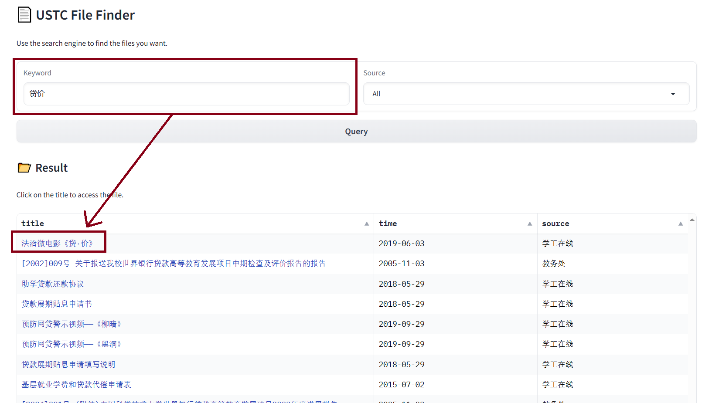
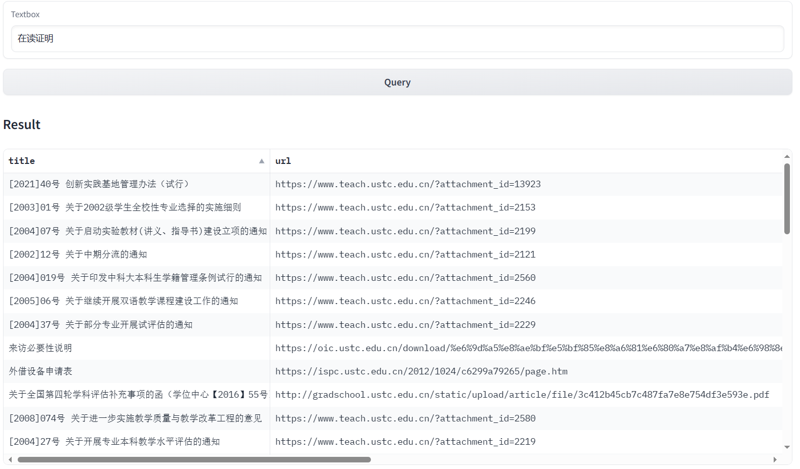
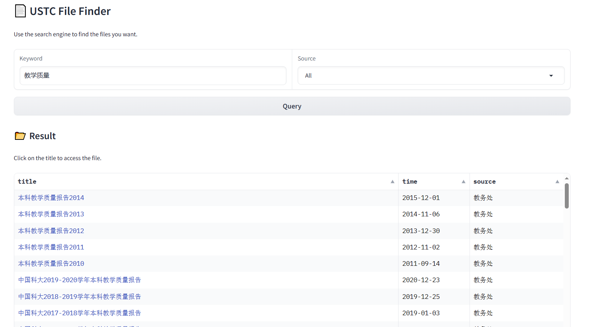

# PPT稿

## 系统设计
- 爬虫：爬取各网站文件信息（标题、URL、日期、来源等）
- HBase：主数据库，存储所有文件信息
- ElasticSearch：分布式搜索引擎，对文件标题进行检索
- Milvus：向量查询数据库，对文件标题的embedding进行向量查询以扩展搜索结果
- 前端：接收用户的查询请求，并美观地展示查询结果

（或换成系统架构设计图）

（贴一张完成效果，给大家一个初印象）

## 系统实现

### 爬虫

### HBase数据库
#### 数据库存储内容

在列族`info`中我们存储了如下文件信息：

|    列名     |          信息          |
| :---------: | :--------------------: |
|    title    |        文件标题        |
|     url     |        文件URL         |
|    time     |      文件发布时间      |
|   source    |        文件来源        |
|  file_type  | 文件在网站中的一级类型 |
| file_type_2 | 文件在网站中的二级类型 |

在列`counter:increment_id`的`row_increment_id`行中我们存储了一个HBase的自增计数器，用于将row_key命名为`f'row_{increment_id}'`。

#### 数据库交互

我们基于Python的`happybase`库，实现了`HBaseHelper`类，通过调用HBase的Thrift服务，用来管理HBase数据库的增删改查操作。

除常规配置外，需要为Thrift服务在hbase-site进行专门配置：

特别是`hbase.thrift.server.socket.read.timeout`必须设置为0，否则超过一定时间（默认60s）没有对hbase数据库进行操作后，HBase的Thrift服务会自动断开连接，从而Python端会出现`TTransportException(type=4, message='TSocket read 0 bytes')`错误(参考github中的issue:https://github.com/python-happybase/happybase/issues/130)。

（上面那一段贴上，可以体现我们工作的深入，以及我们和厂里开发流程的接轨程度）

### ElasticSearch
#### 介绍
HBase:
- 几乎不含对搜索功能的支持

Elasticsearch：
- 分布式、RESTful风格的搜索和数据分析引擎
- 支持分词、倒排索引、模糊查询、查询结果排序

由此，ElasticSearch非常适用于当前文本查询的场景

#### 部署与使用
- 使用docker部署ElasticSearch
- 使用Python的ElasticSearch库来实现我们的项目与ElasticSearch搜索引擎之间的交互，通过实现`ElasticsearchHelper`类，来管理ElasticSearch的连接及增删改查操作。

#### 查询结果展示
20在结果内，而2023不在结果内

即使有标点符号干扰，目标查询结果就在第一个

更好的匹配方案在前，不好的匹配方案在后

### Milvus数据库
#### 介绍
Milvus 是一个云原生的向量数据库，具有以下特点：
- 高性能：性能高超，完成万亿条向量数据搜索的平均延迟以毫秒计
- 高可用、高可靠、高可扩展性：支持分布式部署，具有高容错容灾能力
- 功能强大：增量数据摄取、标量向量混合查询、time travel 等

#### 实现与部署
- 使用docker部署Milvus
- 使用Python的pymilvus库来实现我们的项目与Milvus数据库之间的交互，通过实现`MilvusHelper`类，来管理Milvus数据库的连接及增删改查操作。
- 使用Hugging Face上最热门的中文BERT模型`bert-base-chinese`预训练模型对文件标题及查询关键词生成embedding，并对数据库建立向量索引。

#### 效果展示
- 查询精度差
- 查询开销大

## 成果展示
- 对文件标题进行检索
- 可以按文件来源筛选文件
- 可以按时间顺序对文件进行排序

## 项目总结

### 组员分工

- PB21030838 罗浩铭:负责整体框架的搭建，以及检索部分（包括传统查询数据库elastic search, 向量查询数据库milvus的搭建与交互），并完成了项目在云服务器上的部署，以及上台答辩
- PB21061199 范晨晓:负责爬虫部分（包括设置对不同网页的遍历方式控制），以及对网页数据的解析与存储，参与了与hbase数据库交互的工作
- PB21151807 刘海琳:负责hbase数据库的搭建与交互部分，前端搭建，以及答辩PPT制作

### 总结
- 搭建了一个简单的搜索引擎系统
- 磨练了大数据系统能力
- 实现了一个实用的项目

### The END
欢迎访问和体验：http://47.76.73.185:7860/

